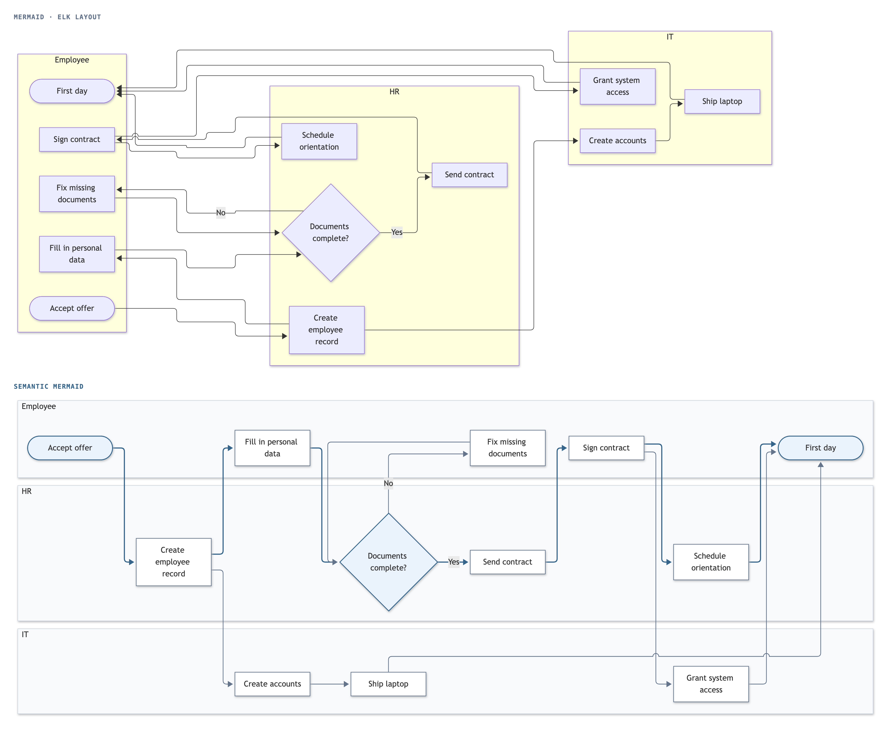
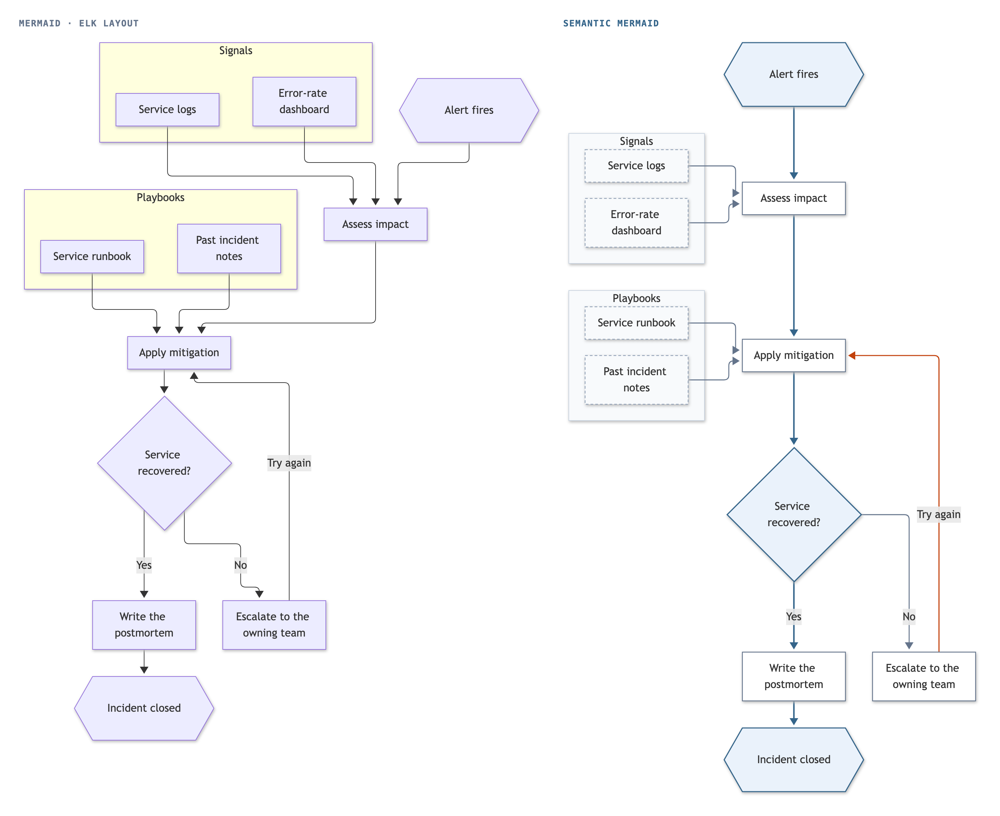
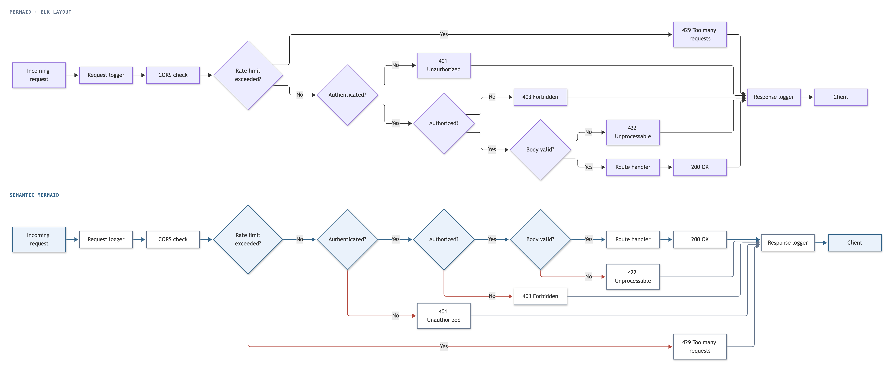

# Semantic Mermaid

[](https://skills.sh/yahorbarkouski/semantic-mermaid)

Better Mermaid flowcharts when agents write and humans read.

Mermaid language is awesome, but it was built for a time when humans wrote the code. Now most diagrams get written by agents, so writing the syntax is very cheap. The diagrams themselves are getting more complicated, and humans need even deeper understanding of what's going on. Semantic Mermaid is our attempt to make those diagrams more comprehensible.

We still use diagrams to explain and understand things. Mermaid's default layout doesn't know anything about that, it's intentless, so the drawing is often harder to grasp than the source. We extend the syntax with a few lines in comments (%% @main, @exit, @retry, @side, @lanes) that say what the diagram means, run a sophisticated layout engine that draws it that way, and ship tools (CLI/SDK + agent skill) so your agents can render better diagrams effortlessly.

We tried it on 20 diagrams where layout really matters. Blind model judges compared our layout to Mermaid's ELK. Semantic Mermaid won 15, lost 0, tied 5.


*The same source ([examples/sign-in.mmd](examples/sign-in.mmd)) drawn by Mermaid's ELK layout (left) and by Semantic Mermaid (right). ELK, the Eclipse Layout Kernel, is the layered layout Mermaid offers as an alternative to its default. One line,* `%% @lanes UA SP IdP`*, names the three subgraphs by their ids (Browser, Service provider and Identity provider) and turns them into swimlanes: every step sits in its party's lane, time runs down, and hand-offs cross between lanes in the gaps between steps. The orange line is the declared retry from the last step back to the first, drawn down the left side of the Browser lane.*

## What you write

```
flowchart TD
  A([Order placed]) --> B{Payment ok?}
  B -->|yes| C[Reserve stock]
  C --> D{In stock?}
  D -->|yes| E[Ship] --> F([Done])
  D -->|no| G[Backorder]
  G --> D
  B -->|no| X[Notify customer]
  R[(Fraud rules)] -.-> B

  %% @main A B C D E F
  %% @exit B -> X
  %% @retry G -> D
  %% @side R
```


With these four lines, the path from "Order placed" to "Done" runs in one straight column. "Notify customer" sits beside the payment decision, the backorder loop returns to the stock check, and the fraud rules sit beside the decision they feed. Colours follow the roles: blue for the main path's arrows and for starts, ends and decisions, rose for exit arrows and for exit boxes that end the flow, orange for retries, and a dashed outline for side boxes.

## Directives


| Directive         | What it says                                                                                     | How it is drawn                                                                                                         |
| ----------------- | ------------------------------------------------------------------------------------------------ | ----------------------------------------------------------------------------------------------------------------------- |
| `@main A B C`     | The path a reader should follow from start to end. `@main none` for trees and dependency graphs. | One straight line                                                                                                       |
| `@exit B -> X`    | An outcome that ends the flow early: an error, a rejection                                       | Leaves the decision from a side corner, across the flow; an exit box with no arrows of its own sits beside the decision |
| `@retry G -> D`   | An arrow back to an earlier step                                                                 | A return along the side                                                                                                 |
| `@side R`         | Boxes, or a whole group, that serve one step: a config, a store, a log                           | Beside that step, on its row                                                                                            |
| `@peers P0 P1 P2` | Boxes that belong side by side, in this order                                                    | Kept in that order                                                                                                      |
| `@lanes A B C`    | Groups that are parties handing work back and forth                                              | Swimlanes, in this order                                                                                                |
| `@colors off`     | Keep Mermaid's own colours                                                                       | No automatic colours                                                                                                    |


Directives go anywhere after the `flowchart` line, usually at the end, and name boxes and subgraphs by their Mermaid ids. They are Mermaid comments (`%%`), so the same file still renders on GitHub, in Notion, or anywhere else Mermaid runs, with that host's own layout. Plain Mermaid works too: without directives, the engine infers the main path, decisions and side boxes from the diagram's structure. The full reference is [docs/LANGUAGE.md](docs/LANGUAGE.md).

## Sized for the page

Every image `render` writes is drawn for the page it will be read on, about 800 px wide: a GitHub README, or a ChatGPT or Codex chat. A diagram so wide that the page would shrink it below 40% of its size is also laid out in the other direction, top-down instead of left to right, and the engine keeps that drawing unless it is clearly worse in other ways. A diagram narrower than the page is centred in a blank frame as wide as the page, the way GitHub centres its own Mermaid diagrams.


*The same source ([samples/food-delivery.mmd](samples/food-delivery.mmd)) on two pages 800 px wide. Written left to right, it is 2024 px wide, and the page shows it at less than 40% of its size. `render` draws its lanes top-down instead, at full size, and prints a `note` line saying why.*

`render --page-width 900` sets another page width, and `--no-fit` keeps the diagram as written, at its own width. In an app that renders with `install`, diagrams are turned only when the app passes the width of its column as `pageWidth`, and are never framed; see [docs/EMBEDDING.md](docs/EMBEDDING.md).

## Install

### Ask your agent

Paste this into Claude Code, Codex, Cursor or any agent with a shell:

```text
Install Semantic Mermaid, so the flowcharts you write lay out by what they mean:
1. Install the skill for yourself: `npx -y skills add yahorbarkouski/semantic-mermaid -g -y -a <agent>`, where <agent> is your own id in the skills CLI, such as `claude-code`, `codex` or `cursor`.
2. Install its CLI, which needs Node 22.12 or later: `npm install -g semantic-mermaid`, then `semantic-mermaid setup` (it downloads a headless browser, about 95 MB, used only to render images).
3. Confirm it works by running this command as it is; it should print a `wrote` line and `stdin: ok`:

semantic-mermaid render - -o "$(mktemp -d)/check.svg" <<'MMD'
flowchart TD
  A --> B
  %% @main A B
MMD
```

### Install it yourself

The skill is on [skills.sh](https://skills.sh/yahorbarkouski/semantic-mermaid). This installs it for every project; it asks which agents to install it for, such as Claude Code, Codex or Cursor, and you select yours with the space bar:

```bash
npx skills add yahorbarkouski/semantic-mermaid -g
```

The skill checks and renders diagrams with the `semantic-mermaid` CLI, which needs Node 22.12 or later:

```bash
npm install -g semantic-mermaid
```

```bash
semantic-mermaid setup
```

`check` runs Mermaid's parser in Node and works right after `npm install`, which takes about 220 MB, most of it Mermaid. `setup` downloads the headless browser that `render` draws in (about 95 MB, 200 MB unpacked), once. On Linux the browser also needs system libraries; if they are missing, `render`'s error message gives the command that installs them.

To use the layout in a web page, or the Node API, add the package to your project with `npm install semantic-mermaid mermaid@~12.1.0`.

## More examples



*Lanes in a left-to-right diagram are rows, and time runs right. The "No" branch leaves the decision from the corner facing its target. The fix-up step comes back into the corner where the decision's inputs arrive.*



`@side Signals Playbooks`*: each group of references sits beside the step it feeds, and the main path stays one column.*



*Four* `@exit` *arrows: the request path is one row, and the rejections drop below it.*

The sources of these figures are in [examples/](examples/), and [samples/](samples/) has ten more annotated diagrams with side-by-side ELK comparisons.

## Use it

### From an agent

With the skill installed, the agent's loop stays close to writing plain Mermaid: write the flowchart, add a directive for everything it means, check once, and deliver. A check takes about 0.15 s and prints `ok` or the exact fix. A wrong directive cannot break the diagram, because the lines are comments, and the agent never opens an image to inspect it.

What the agent delivers depends on where the diagram will be read. A page that runs Semantic Mermaid draws the Mermaid text itself. GitHub and GitLab draw Mermaid with their own layout and ignore the directives, so for a file in a repository the agent pipes the diagram into `semantic-mermaid render` and embeds the SVG it writes as an image. The SVG carries the diagram's text, and `semantic-mermaid source` prints it when the diagram needs to change, so the agent never saves the Mermaid source to a file of its own. Where only text fits, such as a pull-request description, the agent writes a `mermaid` code block. In a chat or a terminal it renders a PNG to a temporary file and shares it. The skill itself is [skills/semantic-mermaid/SKILL.md](skills/semantic-mermaid/SKILL.md).

### From the command line

```bash
semantic-mermaid check examples/order.mmd
```

```bash
semantic-mermaid render examples/order.mmd -o order.svg -o order.png
```

```bash
semantic-mermaid source order.svg
```

A file argument of `-` reads the diagram from standard input, so a diagram another program writes never needs a file; `render -` then takes the image to write from `-o`. `render` creates the image's folder, and writes nothing while the diagram has errors. Every SVG it writes carries the diagram's text, which `source` prints.

`render` draws images for a page about 800 px wide, as [Sized for the page](#sized-for-the-page) describes; `--page-width` sets another width, and `--no-fit` keeps the diagram as written. `check` prints `ok`, or each problem with its line and what fixes it, and exits with status 1 when there is an error. With `@exit B -> X` in `examples/order.mmd` changed to `@exit B -> Y`:

```
order.mmd: 1 error
error: line 11: @exit: no node "Y"; ids are A, B, C, D, E, F, G, X, R
```

It also warns when the diagram's own configuration selects another layout (`config: layout: elk`), which would switch the directives off. Add `--verbose` to see what the engine understood:

```
order.mmd: ok
understood:
  main path (declared): A -> B -> C -> D -> E -> F
  exits (declared): B -> X
  retries, drawn as returns (declared): G -> D
  side branches of main-path decisions (inferred): D -> G
  side boxes: R (declared)
```

`render --verbose` also prints the layout the engine chose:

```
layout: semantic (score 0.18; plain ELK 1.13; lower is better)
  crossings 0, arrows through boxes 0, label clashes 0, hugging arrows 0, crossed group titles 0, aspect 0.72
```

The score is the engine's own measure, and it compares layouts of the same diagram only. The second line counts defects in the chosen layout: arrow crossings, arrows through boxes, labels touching other arrows, unrelated arrows running side by side ("hugging"), arrows across group titles, and the drawing's width-to-height ratio ("aspect"). When the chosen layout leaves out something you declared, for example a peer order that would have cost crossings, `render` says so in a `note` line. `render --elk` draws the same diagram with Mermaid's ELK layout, for comparison.

### In a web page

The engine registers as a Mermaid 12 layout named `semantic`. In an app that already renders Mermaid, one call opts in the flowcharts that carry directives and leaves every other diagram as it was:

```js
import mermaid from 'mermaid';
import { install } from 'semantic-mermaid';

const semantic = install(mermaid, { apply: 'directives' });
mermaid.initialize({ startOnLoad: false });
const { svg } = await mermaid.render('d1', source);
semantic.report('d1');                       // what the engine understood and chose
```

Mermaid strips comments before layout, so `install` wraps `mermaid.render` to hand each diagram's text to the engine. [docs/EMBEDDING.md](docs/EMBEDDING.md) covers the rest for app developers: the other ways to opt diagrams in, themes, and what the layout costs in download size and render time.

### From Node

```js
import { checkDiagram } from 'semantic-mermaid/check';

const report = await checkDiagram(source);   // what the engine understood, and problems; no browser
```

```js
import { createRenderer } from 'semantic-mermaid/toolchain';

const renderer = await createRenderer();
const { svg, png, report } = await renderer.render(source, { png: true });
await renderer.close();
```

## How it works


1. **Facts.** The engine reads the directives and binds them to the diagram's boxes and arrows, reporting any that don't match. Whatever the author didn't declare is inferred from structure. The result, the facts, is what the engine knows about the diagram's meaning ([src/facts](src/facts/resolve.js)).
2. **Candidates.** It builds a handful of layouts from the facts ([src/engine/layout.js](src/engine/layout.js)). Most are configurations of Mermaid's own ELK layout: a straightened main path, arrows that leave decisions from fixed corners, side boxes beside their step, retries reversed into returns, peers in order. Declared lanes get a swimlane layout of their own ([src/engine/lanes.js](src/engine/lanes.js)). Plain ELK is always one of the candidates.
3. **Score.** Each candidate is measured: arrows through boxes, crossings, label clashes, crowded arrow ends, length, bends, shape, and how straight the main path is ([src/engine/score.js](src/engine/score.js)). The lowest score wins. A candidate that leaves out declared lanes or side groups pays a penalty, so it wins only by a clear margin.
4. **Draw.** Mermaid draws the winner. The repository keeps a copy of Mermaid's ELK plugin, `@mermaid-js/layout-elk`, with two small patches that let the engine hand Mermaid its layout ([vendor/layout-elk](vendor/layout-elk/VENDORED.md)). Colours are applied by role, and styles the author set are kept.


## How well it works

- **Diagrams where meaning matters.** 20 flowcharts with parties, retries, exits and reference material were drawn twice from the same annotated source, once by Mermaid's ELK layout and once by Semantic Mermaid. Two Claude agents annotated 15 of them using only the skill and the CLI; the engine's author annotated the other 5. Blind panels of Claude Sonnet compared each pair with colours off, once in each order, and a win needed both panels to agree. Semantic Mermaid won 15, lost none and tied 5 (a tie is a pair both panels called even, or one they disagreed on). All three diagrams drawn as swimlanes won, and five of their six verdicts were the strongest grade, "much better".
- **Ordinary diagrams.** On 236 flowcharts, real ones from public repositories plus synthetic test diagrams, every diagram, written in plain Mermaid without directives, renders without errors. Against ELK, arrow crossings fall from 443 to 430, and crowded arrow ends (combs, stacked arrowheads) from 982 to 776.
- **Speed.** A check parses only and takes about 0.15 s from the command line. In the browser, the median render of the 236 flowcharts takes 60 ms, against 34 ms for plain ELK, because the engine lays each diagram out several times.

The judges are language models, one panel for each order, and the 20 diagrams were chosen to show the patterns the engine acts on, so read the first result as a showcase. Two of the 20 drawings have changed since they were judged, both with a straighter main path. On ordinary diagrams the goal is to stay at least even with ELK. Mermaid's default layout, dagre, was not part of these comparisons.

## Limits

- Flowcharts only (`flowchart` and `graph`). With `install`'s `apply` option, other diagram types keep Mermaid's configured layout; with `layout: 'semantic'` set in Mermaid's configuration, they get Mermaid's ELK layout, and mindmaps fail to render as they do under ELK.
- Lanes need top-level groups that hold boxes only, and the diagram can't have other groups besides the lanes. A bottom-up or right-to-left diagram gets its lanes drawn top-down or left-to-right.
- A box beside its step must be in the same group as the step, the arrow between them can carry a label of at most 24 characters, and at most two boxes sit beside one step. `check` warns when a declared box breaks these limits.
- Automatic colours have a light and a dark palette, chosen by Mermaid's theme; under `forest` they switch off.
- The vendored plugin ties the engine to Mermaid 12.1, and the CLI needs Node 22.12 or later, as Mermaid 12.1 does.


## Development

From a clone of this repository:

```bash
npm install && node toolchain/cli.js setup
```

```bash
npm test             # unit tests and browser integration tests
```

```bash
npm run check-types  # JSDoc types, strict mode
```

```bash
npm run images       # regenerate docs/images and the example pictures from examples/
```

```bash
node scripts/compare.js path/to/diagrams --out /tmp/compare   # every diagram in a folder, both layouts
```

```bash
npm run vendor       # refresh vendor/layout-elk from node_modules and apply the patches
```

```bash
npm run types        # write the type declarations into types/, as npm pack does
```

## License

MIT. The vendored plugin in [vendor/layout-elk](vendor/layout-elk) is part of Mermaid and keeps Mermaid's MIT license.