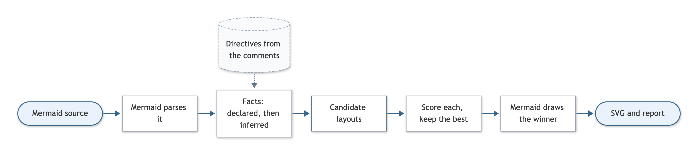

# Semantic Mermaid

[](https://www.npmjs.com/package/semantic-mermaid) [](https://skills.sh/yahorbarkouski/semantic-mermaid)

The Mermaid language is awesome, but it was built for a time when humans wrote the code. Now most diagrams are written by agents, and writing the syntax is very cheap. The diagrams themselves are getting more complicated, and humans need an even deeper understanding of what's going on. Semantic Mermaid is our attempt to make those diagrams more comprehensible.

We still use diagrams to explain and understand things. Mermaid's default layout knows nothing about that: it is intentless, so the drawing is often harder to grasp than the source. We extend the syntax with a few comment lines (`%% @main`, `@exit`, `@retry`, `@side`, `@lanes`) that say what the diagram actually means, run a sophisticated layout engine that draws it that way, and ship tools (a CLI, an SDK and an agent skill) so your agents can render better diagrams effortlessly.

We tested Semantic Mermaid on 236 flowcharts, where, by the engine's own measures, it drew fewer arrow crossings and about a fifth fewer crowded arrow ends than Mermaid's default layout. Blind model judges then compared the two on 20 diagrams written with directives, chosen to show parties, retries, exits and reference material: Semantic Mermaid **won 15, lost 0 and tied 5**, judged with colours off, so on layout alone.


*The same source ([examples/sign-in.mmd](examples/sign-in.mmd)) drawn by Mermaid's ELK layout (left) and by Semantic Mermaid (right). Mermaid's own `swimlane-beta` diagram draws lanes too; [Compared with Mermaid's swimlanes](#compared-with-mermaids-swimlanes) shows how the two differ.*

**Contents:** [How the extension looks like](#how-the-extension-looks-like) · [Directives](#directives) · [Auto-sized for the page](#auto-sized-for-the-page) · [Get started](#get-started) · [More examples](#more-examples) · [Compared with Mermaid's swimlanes](#compared-with-mermaids-swimlanes) · [How it works](#how-it-works) · [How we tested](#how-we-tested) · [Limits](#limits) · [Development](#development)

## How the extension looks like

```
flowchart TD
  A([Order placed]) --> B{Payment ok?}
  B -->|yes| C[Reserve stock]
  C --> D{In stock?}
  D -->|yes| E[Ship] --> F([Done])
  D -->|no| G[Backorder]
  G --> D
  B -->|no| X[Notify customer]
  R[(Fraud rules)] -.-> B

  %% @main A B C D E F
  %% @exit B -> X
  %% @retry G -> D
  %% @side R
```


With these four lines, the path from "Order placed" to "Done" runs in one straight column. "Notify customer" sits beside the payment decision, the backorder loop returns to the stock check, and the fraud rules sit beside the decision they feed. Colours follow the roles: blue for the main path's arrows and for starts, ends and decisions, rose for exit arrows and for exit boxes that end the flow, orange for retries, and a dashed outline for side boxes.

## Directives


| Directive | What it says | How it is drawn |
| --- | --- | --- |
| <code>@main&nbsp;A&nbsp;B&nbsp;C</code> | The path a reader should follow from start to end. `@main none` for trees and dependency graphs. | One straight line where the layout allows |
| <code>@exit&nbsp;B&nbsp;-&gt;&nbsp;X</code> | An outcome that ends the flow early: an error, a rejection | Leaves the decision from a side corner, across the flow; an exit box with no arrows of its own sits beside the decision |
| <code>@retry&nbsp;G&nbsp;-&gt;&nbsp;D</code> | An arrow back to an earlier step | A return along the side |
| <code>@side&nbsp;R</code> | Boxes, or a whole group, that serve one step: a config, a store, a log | Beside that step, on its row |
| <code>@peers&nbsp;P0&nbsp;P1&nbsp;P2</code> | Boxes that belong side by side, in this order | Kept in that order |
| <code>@lanes&nbsp;A&nbsp;B&nbsp;C</code> | Groups that are parties handing work back and forth | Swimlanes, in this order |
| <code>@colors&nbsp;off</code> | Keep Mermaid's own colours | No automatic colours |


Directives go anywhere after the `flowchart` line, usually at the end, and name boxes and subgraphs by their Mermaid ids. They are Mermaid comments (`%%`), so the same file still renders on GitHub, in Notion, or anywhere else Mermaid runs, with that host's own layout. Plain Mermaid works too: without directives, the engine infers the main path, decisions and side boxes from the diagram's structure. The full reference is [docs/LANGUAGE.md](docs/LANGUAGE.md).

## Auto-sized for the page

Every image `render` writes is drawn for the page it will be read on, about 800 px wide: a GitHub README, or a ChatGPT or Codex chat. A diagram so wide that the page would shrink it below 40% of its size is also laid out in the other direction, top-down instead of left to right, and the engine keeps that drawing unless it is clearly worse in other ways. A diagram narrower than the page is centred in a blank frame as wide as the page.


*The same source ([examples/food-delivery.mmd](examples/food-delivery.mmd)) on two pages 800 px wide. Written left to right, it is 2024 px wide, and the page shows it at less than 40% of its size. `render` draws its lanes top-down instead, at full size, and prints a `note` line saying why.*

`render --page-width 900` sets another page width, and `--no-fit` draws for no page: the diagram keeps its own width. In an app that renders with `install`, diagrams are turned for the page only when the app passes the width of its column as `pageWidth`, and are never framed; see [docs/EMBEDDING.md](docs/EMBEDDING.md). Either way, a drawing longer than 8:1 is also tried turned.

## Get started

Paste this into Claude Code, Codex, Cursor or any agent with a shell:

```text
Install Semantic Mermaid, so the flowcharts you write lay out by what they mean:
1. Install the skill for yourself: `npx -y skills add yahorbarkouski/semantic-mermaid -g -y -a <agent>`, where <agent> is your own id in the skills CLI, such as `claude-code`, `codex` or `cursor`.
2. Install its CLI, which needs Node 22.12 or later: `npm install -g semantic-mermaid`, then `semantic-mermaid setup` (it downloads a headless browser, about 95 MB, used only to render images).
3. Confirm it works by running this command as it is; it should print a `wrote` line and `stdin: ok`:

semantic-mermaid render - -o "$(mktemp -d)/check.svg" <<'MMD'
flowchart TD
  A --> B
  %% @main A B
MMD
```

Or install it yourself: the skill from [skills.sh](https://skills.sh/yahorbarkouski/semantic-mermaid), which asks which agents to install it for (select yours with the space bar), and the CLI it uses, which needs Node 22.12 or later. `setup` downloads a headless browser, about 95 MB, used only to render images.

```bash
npx skills add yahorbarkouski/semantic-mermaid -g
```

```bash
npm install -g semantic-mermaid && semantic-mermaid setup
```

Start a new agent session so it picks up the skill, then ask for a diagram, such as "add a flowchart of our checkout to the README". From then on your agent writes the directives, checks them, and delivers each diagram in a form its reader can see, such as an SVG embedded in a GitHub README, since GitHub draws Mermaid with its own layout. The skill, [skills/semantic-mermaid/SKILL.md](skills/semantic-mermaid/SKILL.md), tells it how. To run the CLI yourself, see [docs/CLI.md](docs/CLI.md); to draw Semantic Mermaid in your own app, see [docs/EMBEDDING.md](docs/EMBEDDING.md).

## More examples


*Lanes in a left-to-right diagram are rows, and time runs right. The "No" branch leaves the decision from the corner facing its target. The fix-up step comes back into the corner where the decision's inputs arrive.*


`@side Signals Playbooks`*: each group of references sits beside the step it feeds, and the main path stays one column.*


*Four* `@exit` *arrows: the request path is one row, and the rejections drop below it.*

The [examples gallery](examples/README.md) has these and every other annotated diagram, 17 in all, each with its source and a picture beside ELK.

## Compared with Mermaid's swimlanes

Mermaid 11.16 added a swimlane diagram of its own, `swimlane-beta`, written like a flowchart with its lanes as subgraphs. Here is an expense claim passed between an employee, a manager and finance, drawn by it and by Semantic Mermaid:


*The same nodes, arrows and lanes ([examples/expense.mmd](examples/expense.mmd)); for the left drawing only the first line was changed, to `swimlane-beta TD`. Both drawings are about the same size.*

- **The agent states intent, and the engine picks the form.** `%% @lanes` says who does what, `@retry` which arrows send work back, and `@exit` which outcome ends the claim. The engine lays the diagram out both as lanes and as ordinary groups, scores each, and keeps the better, so a lane declaration that doesn't fit costs little: stages a process passes through once come out as groups.
- **Returns and exits stay beside their steps.** In `swimlane-beta`, the missing receipt goes back to finance on a detour down the page, along the bottom and up the right edge, and "Claim rejected" lands at the bottom, far from "Receipts complete?". Semantic Mermaid draws both returns as orange lines up the left of the Employee lane, each back to the step it repeats, and the rejection beside its decision.
- **Time runs one way.** Steps are placed in rows by when they happen, so the claim reads top to bottom, and hand-offs cross between lanes in the gaps between rows.
- **Hosts without the engine still draw it.** On GitHub or any other host that doesn't run Semantic Mermaid, a diagram with `@lanes` draws as an ordinary flowchart with subgraphs, because the directives are comments; drawing it in lanes takes the engine, which needs Mermaid 11 or 12. A `swimlane-beta` diagram draws in lanes on any host with Mermaid 11.16 or later, and not at all on an older one.

## How it works



1. **Facts.** The engine reads the directives and binds them to the diagram's boxes and arrows, reporting any that don't match. Whatever the author didn't declare is inferred from structure. The result, the facts, is what the engine knows about the diagram's meaning ([src/facts](src/facts/resolve.js)).
2. **Candidates.** It builds a handful of layouts from the facts ([src/engine/layout.js](src/engine/layout.js)). Most are configurations of Mermaid's own ELK layout: a straightened main path, arrows that leave decisions from fixed corners, side boxes beside their step, retries reversed into returns, peers in order. Declared lanes get a swimlane layout of their own ([src/engine/lanes.js](src/engine/lanes.js)). Plain ELK is always one of the candidates.
3. **Score.** Each candidate is measured: arrows through boxes, crossings, label clashes, crowded arrow ends, length, bends, shape, and how straight the main path is ([src/engine/score.js](src/engine/score.js)). The lowest score wins. A candidate that leaves out declared lanes or side groups pays a penalty, so it wins only by a clear margin.
4. **Draw.** Mermaid draws the winner. The repository keeps a copy of Mermaid's ELK plugin, `@mermaid-js/layout-elk`, with four small patches: two let the engine hand Mermaid its layout, and two make ELK's in-page worker pass messages without timer delays ([vendor/layout-elk](vendor/layout-elk/VENDORED.md)). Colours are applied by role, and styles the author set are kept.


## How we tested

- **The 20 judged diagrams** have parties, retries, exits and reference material; 11 of them are also among the 236. Agents wrote the directives for 15 of them using only the skill and the CLI; the engine's author wrote the other 5. Each was drawn from the same source by Semantic Mermaid and by ELK, Mermaid 12's default layout, with colours off. Two panels of Claude Sonnet judged each pair blind, one panel for each order, and a win needed both to agree; a pair they split on, or both called even, counts as a tie. The first round was 15 wins, 1 loss and 4 ties. The loss was pipeline stages declared as lanes; lanes then got a penalty, the skill now says stages are not lanes, and that pair, judged again, tied. Three of the four diagrams that declared lanes were drawn in lanes and won, five of their six verdicts "much better"; the fourth is that pipeline. Since the judging, two drawings have changed with a straighter main path, and at `render`'s default 800 px page two more are drawn top-down; `--no-fit` draws those two as judged.
- **The 236 ordinary flowcharts** are real ones from public repositories plus synthetic test diagrams, written without directives. Against ELK, arrow crossings fall from 443 to 430 and crowded arrow ends (arrowheads or tails piled within 14 px) from 982 to 776, by the engine's own measures, the same ones it uses to choose a layout. Every diagram that Mermaid itself can parse renders; two of the 236 put a comment line above their frontmatter, which Mermaid rejects. Dagre, the default before Mermaid 12, was not compared.
- **Speed.** A check takes about 0.15 s from the command line. In the browser, a typical diagram renders in about 34 ms, against about 23 ms for ELK.

## Limits

- Flowcharts only (`flowchart` and `graph`); other diagram types keep Mermaid's own layout. [docs/EMBEDDING.md](docs/EMBEDDING.md) has the details for apps.
- Mermaid 11 or 12. The engine brings its own patched copy of Mermaid's ELK plugin, so it does not depend on the ELK an app uses. Its tests pass on Mermaid 11.17 and 12.1, it renders the 17 examples back to 11.0, and CI checks the newest 11 and 12. Mermaid 11 draws boxes in its classic look, so there the same diagram can come out with a different layout. The CLI installs Mermaid 12, so it needs Node 22.12 or later, as Mermaid 12 does.
- Each directive's rules, such as what a lane may hold, are in [docs/LANGUAGE.md](docs/LANGUAGE.md), and `check` says when a diagram breaks one.

## Development

From a clone of this repository:

```bash
npm install && node toolchain/cli.js setup
```

```bash
npm test             # unit tests and browser integration tests
```

```bash
npm run check-types  # JSDoc types, strict mode
```

```bash
npm run images       # regenerate docs/images and the example pictures from examples/
```

```bash
node scripts/compare.js path/to/diagrams --out /tmp/compare   # every diagram in a folder, both layouts
```

```bash
npm run vendor       # refresh vendor/layout-elk from node_modules and apply the patches
```

```bash
npm run types        # write the type declarations into types/, as npm pack does
```

## License

MIT. The vendored plugin in [vendor/layout-elk](vendor/layout-elk) is part of Mermaid and keeps Mermaid's MIT license.