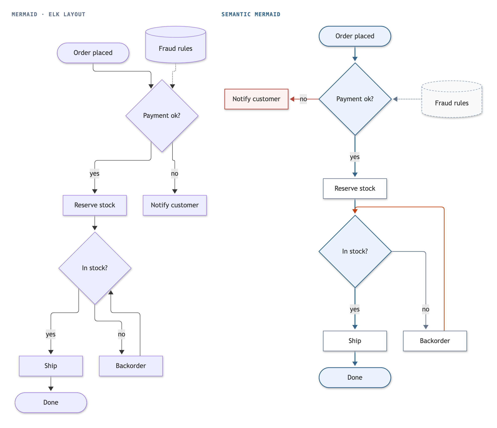

# Semantic Mermaid

Semantic Mermaid is Mermaid flowchart syntax plus comment directives that state what the diagram means: which path is the main one, which arrows are exits or retries, which boxes only serve one step, which boxes are peers, which groups are parties that hand work back and forth. The layout engine reads them and draws the diagram accordingly.

Every directive is a Mermaid comment (`%%`), so an annotated diagram is still plain Mermaid. GitHub, Notion, Obsidian and any other Mermaid host render it unchanged; hosts with the semantic layout draw it better.

```
flowchart TD
  A([Order placed]) --> B{Payment ok?}
  B -->|yes| C[Reserve stock]
  C --> D{In stock?}
  D -->|yes| E[Ship] --> F([Done])
  D -->|no| G[Backorder]
  G --> D
  B -->|no| X[Notify customer]
  R[(Fraud rules)] -.-> B

  %% @main A B C D E F
  %% @exit B -> X
  %% @retry G -> D
  %% @side R
```

<p align="center"></p>

On the right, with these directives the main path runs in one straight column, "Notify customer" sits beside the payment decision on the same row, the backorder loop is drawn as a return, and the fraud rules sit beside the decision they feed.

## Directives

A directive is a line `%% @name arguments`. Arguments name boxes by their Mermaid ids (`A`, `B`), never by their labels. An arrow is written `From -> To`; several arrows in one directive are separated by commas.

| Directive | Arguments | Meaning | Effect on the layout |
|---|---|---|---|
| `@main` | ids, in order, or `none` | The path a reader should follow from start to end, through each decision's normal outcome; `none` for trees and dependency graphs that have no such path | One straight line where the layout allows; decisions continue along it; its arrows are drawn in blue |
| `@exit` | arrows | An outcome that ends or abandons the flow: an error, a rejection, an early exit | Leaves its decision from the side; a box that ends there sits beside the decision; drawn in rose |
| `@retry` | arrows | An arrow back to an earlier step: a retry, a loop, a recovery | Drawn as a return against the flow, on the side its target sits; drawn in orange |
| `@side` | ids, or a group id | Boxes that serve one step: a configuration, a store, a log, a notification; or a group of such boxes | Sits beside the step, on its row (a group sits beside it as one block); drawn with a dashed outline |
| `@peers` | ids, in order | Boxes that belong side by side, in this order (levels, versions, steps 1 to 3) | Kept in the declared order |
| `@lanes` | group ids, in order | Groups that are parties handing work back and forth: people, teams, services | Swimlanes in this order, with time running along them: columns in a top-down diagram, rows in a left-to-right one |
| `@colors` | `on` or `off` | Automatic colours | `off` keeps Mermaid's default colours |

Rules:

- `@main` is declared at most once, with an arrow from each id to the next. `@main none` turns off main-path inference.
- `@exit` and `@retry` name arrows that exist in the diagram. If two arrows join the same pair of boxes, both get the role.
- A `@side` box must have exactly one arrow; otherwise it is laid out as a normal box and a warning says why. A `@side` group must link to one step outside it, with all its arrows running the same way, and listing every box of a group declares the group. A side box or group and its step must sit in the same group (or both at the top level).
- `@lanes` names top-level groups that hold boxes only, and the diagram has no other groups. No arrow may start or end at a lane itself. Boxes outside every lane share a column before the lanes (a row, in a left-to-right diagram). A bottom-up (`BT`) or right-to-left (`RL`) diagram gets its lanes drawn top-down or left-to-right.
- A box beside its step (a side box, or an exit that ends the flow) needs an arrow label of 24 characters or fewer, or none, and at most two boxes sit beside one step. `check` warns when a declared box breaks either limit.
- An unknown or misspelt directive is an error, so a typo cannot silently drop what it declares.
- Directives may appear anywhere after the first line. If the diagram has YAML frontmatter (`---`), the frontmatter must come first, as Mermaid requires.

## What happens without directives

The engine works on plain Mermaid as well. It infers from structure what it can:

- **Main path:** the longest path from an entry through solid arrows (dotted arrows count less), avoiding loops. Its arrows are straightened, but not where that would break a symmetric fan-out or a merge.
- **Decisions:** diamond-shaped boxes. The outcome on the main path continues straight; the others leave from the side.
- **Side boxes:** a box with a single dotted arrow to a step that has at least two other arrows.
- **Loops:** left to ELK's cycle breaking.

Inferred decisions, starts, ends and side boxes are coloured like declared ones. The main path's arrows and exits are coloured only when declared, because an inferred path may be wrong and a "No" outcome is not an error unless `@exit` says so.

## How the layout uses the facts

For every diagram, the engine builds a few ELK layouts from the same Mermaid graph:

- plain ELK;
- ELK with the facts applied (straight main path, decision ports, side boxes beside their step, returns for retries, peers in order);
- the same with fan-outs drawn as shared trunks, and the same with network-simplex node placement, which keeps a declared main path straight where ELK's default placement bends it (skipped for graphs whose arrows skip more than 500 layers in all, where it would take seconds);
- variants without decision ports, without returns, without forced peer order or with side groups left in place, when the diagram has them;
- the other direction when the drawing is a strip longer than 8:1, or when the page it is drawn for would show it at under 40% of its size (`render` assumes a page 800 px wide; an app passes `pageWidth` to `install`);
- top-down or left-to-right versions when the author wrote `BT` or `RL`;
- with `@lanes`, a swimlane layout computed without ELK: every box gets a time row from the flow and its lane's column, the main path runs straight down each lane, arrows between lanes turn in the gaps between rows on tracks of their own, and returns run beside a lane where they cross nothing, or outside the lanes.

In each layout with the facts applied, a main-path box that ELK pushed a little aside moves back onto the path's line, when that keeps it clear of other boxes and arrows and scores better; decisions stay where ELK put them, because their arrows meet them at the corners.

Each layout is measured: arrows through boxes, crossings, label clashes, crowded arrow ends, arrows across group titles, length, bends, arrows against the flow, shape, main-path straightness and peer order. The lowest score wins, and plain ELK is always in the running. A layout that leaves out declared lanes or side groups pays a penalty, so it wins only by a clear margin, and `render` then says so in a `note` line. Labels that touch another arrow slide along their own arrow, and group titles move to whichever end of their frame no arrow crosses.

The `check` command parses the diagram without drawing it and prints `ok`, or each problem with its line and what fixes it (the valid ids, where an arrow really leads). With `--verbose` it also prints what the engine understood. `render --verbose` adds the layout the engine chose. When the chosen layout leaves out something the author declared (a main path it does not straighten, peers it does not keep in order, a side group it leaves in place, lanes it draws as ordinary groups), `render` says so in a `note` line.
