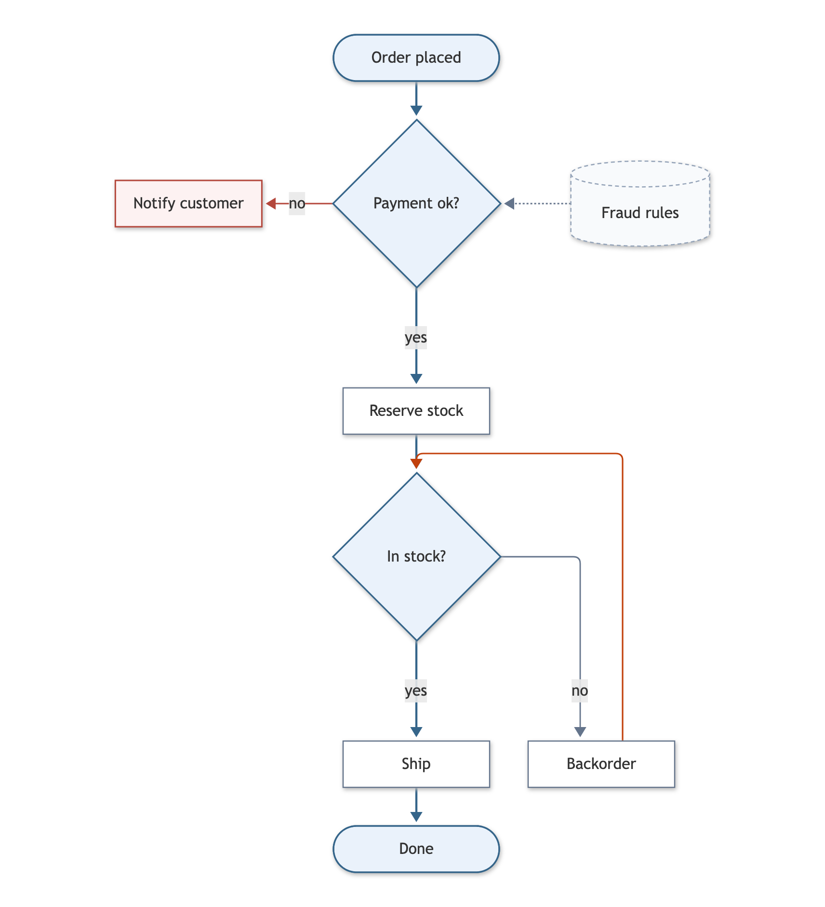
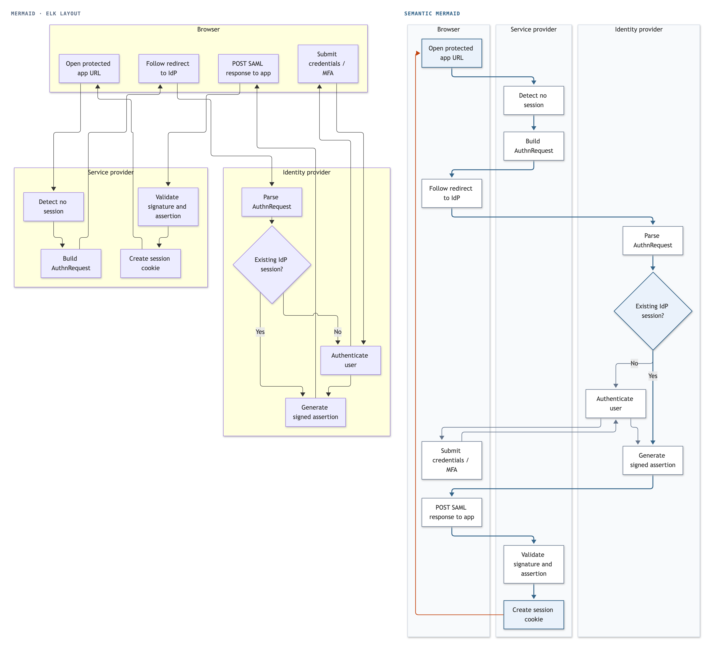
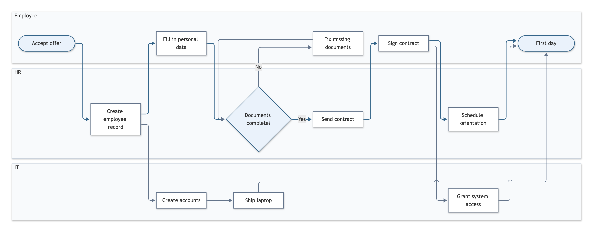
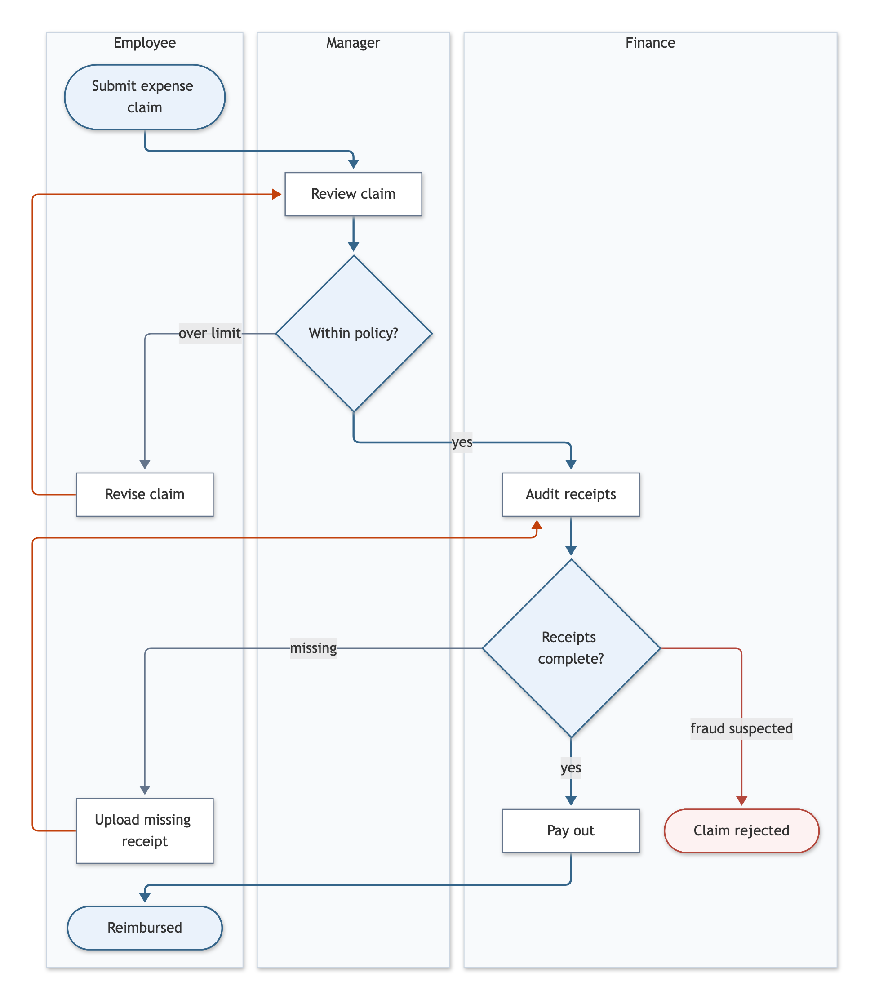
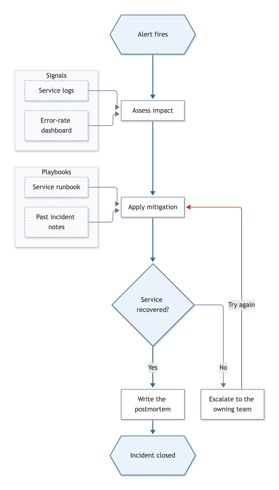
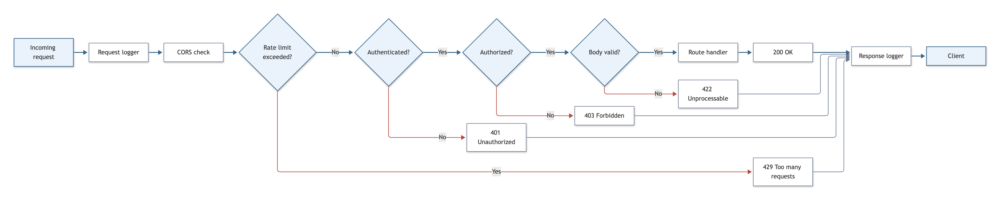

# Examples

Each example is a Mermaid source file with Semantic Mermaid directives, next to a PNG of how the semantic layout draws it for a page 800 px wide, `render`'s default. GitHub and other Mermaid hosts draw these sources with their own layout, which ignores the directives, so the PNGs show what the engine does. Regenerate them with `npm run images`.

## [order.mmd](order.mmd): main path, exit, retry, side box

`@main`, `@exit B -> X`, `@retry G -> D`, `@side R`. The order flow runs in one column, the rejection sits beside the payment decision, and the fraud rules sit beside the decision they feed.

## [sign-in.mmd](sign-in.mmd): swimlanes, top-down

`@lanes UA SP IdP` with a retry back to the first step. A SAML sign-in passes between the browser, the service provider and the identity provider, one lane each, with time running down.

## [onboarding.mmd](onboarding.mmd): swimlanes, left-to-right

`@lanes EMP HR IT`. In a left-to-right diagram the lanes are rows and time runs right.

## [expense.mmd](expense.mmd): lanes with returns and an exit

`@lanes Emp Mgr Fin`, two `@retry` arrows and one `@exit`. An expense claim passes between the employee, the manager and finance; both returns from the employee run up the left of the Employee lane, each back to the step it repeats, and the rejection sits beside the decision that leads to it.

## [incident.mmd](incident.mmd): side groups

`@side Signals Playbooks`. Each group of references sits beside the step it feeds.

## [gateway.mmd](gateway.mmd): exits beside a straight path

Four `@exit` arrows. Written left to right, the request path is one row 2507 px wide with the rejections below it, which an 800 px page would show at 32% of its size, so `render` draws it top-down: the request path is one column, and each rejection sits beside its check. `render --no-fit` keeps the row.

## [pipeline.mmd](pipeline.mmd): a side input

`@side dir`. The engine's own pipeline, used in the main README.

