# Examples

Each example is a Mermaid source file with Semantic Mermaid directives, next to a picture of it drawn by Mermaid's ELK layout, Mermaid 12's default, and by Semantic Mermaid, each at its own width. GitHub and other Mermaid hosts draw these sources with their own layout, which ignores the directives. `render` draws for an 800 px page by default, so for the widest examples its output differs from these pictures; see [Auto-sized for the page](../README.md#auto-sized-for-the-page). Regenerate the pictures with `npm run images`.

## [order.mmd](order.mmd): main path, exit, retry, side box

`@main`, `@exit B -> X`, `@retry G -> D`, `@side R`. The order flow runs in one column, the rejection sits beside the payment decision, and the fraud rules sit beside the decision they feed.

## [sign-in.mmd](sign-in.mmd): swimlanes, top-down

`@lanes UA SP IdP` with a retry back to the first step. A SAML sign-in passes between the browser, the service provider and the identity provider, one lane each, with time running down.

## [expense.mmd](expense.mmd): lanes with returns and an exit

`@lanes Emp Mgr Fin`, two `@retry` arrows and one `@exit`. An expense claim passes between the employee, the manager and finance; both returns from the employee run up the left of the Employee lane, each back to the step it repeats, and the rejection sits beside the decision that leads to it.

## [dashboard.mmd](dashboard.mmd): four lanes with requests and replies

`@lanes Browser API Auth Data`, a declared main path and one `@exit`. A dashboard page load passes from the browser to the API server, which checks the token with the auth service and queries two tables; the auth service's reply goes back to the handler that asked, and an expired token ends at "Sign in again", outside the lanes. [Compared with Mermaid's swimlanes](../README.md#compared-with-mermaids-swimlanes) draws it with `swimlane-beta` as well.

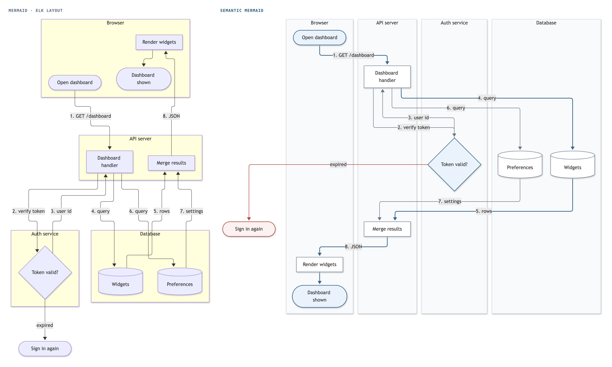

## [onboarding.mmd](onboarding.mmd): swimlanes, left to right

`@lanes EMP HR IT`. In a left-to-right diagram the lanes are rows and time runs right.

## [food-delivery.mmd](food-delivery.mmd): a hand-off chain in lanes

`@lanes Customer Restaurant Courier` and a declared main path. An order passes from the customer to the restaurant to the courier and back to the customer.

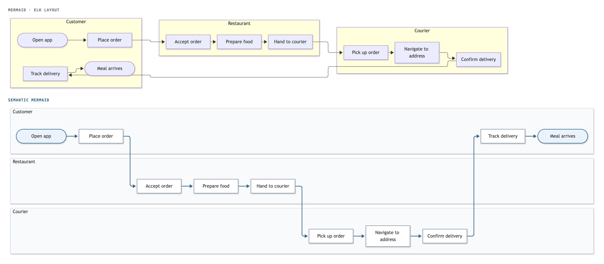

## [incident.mmd](incident.mmd): side groups

`@side Signals Playbooks`. Each group of references sits beside the step it feeds.

## [gateway.mmd](gateway.mmd): exits off a straight row

Four `@exit` arrows. The request path is one row, and the rejections drop below it. On an 800 px page this row would show at 32% of its size, so `render` draws it top-down by default.

## [api-gateway.mmd](api-gateway.mmd): three exits

Three `@exit` arrows, for 401, 403 and 429. A request is checked for authentication, scope and quota on its way to a service.

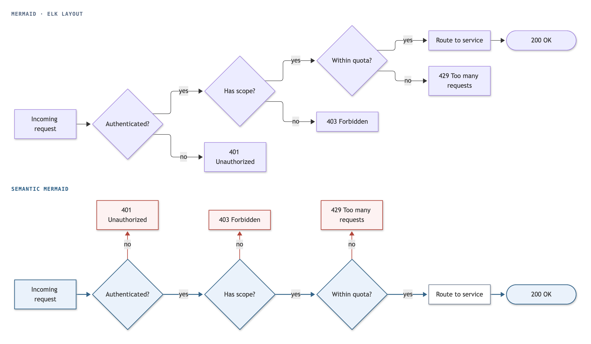

## [ci-pipeline.mmd](ci-pipeline.mmd): exits from a pipeline

Two `@exit` arrows: failing tests notify the author, and a failed deploy rolls back and pages on-call.

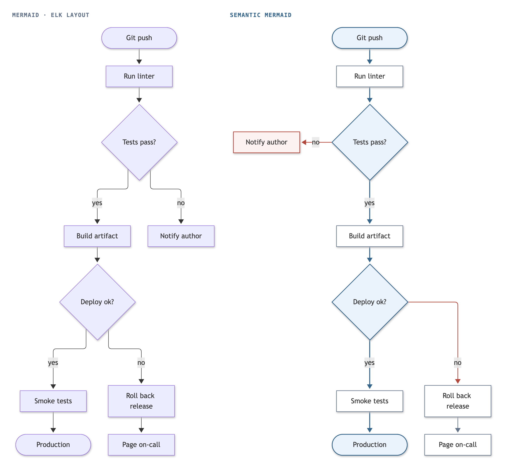

## [password-reset.mmd](password-reset.mmd): two early endings

Two `@exit` arrows: an unknown account gets a generic message, and an expired link ends the reset.

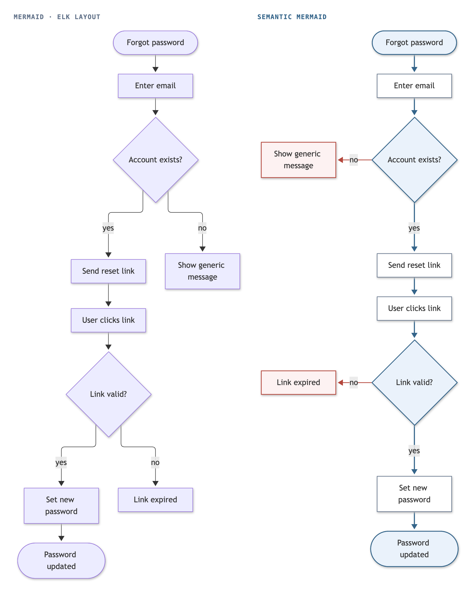

## [coffee-order.mmd](coffee-order.mmd): exits and a side box

Two `@exit` arrows, for a customer who leaves and a declined payment, and `@side Loyalty` for the loyalty card the payment step reads.

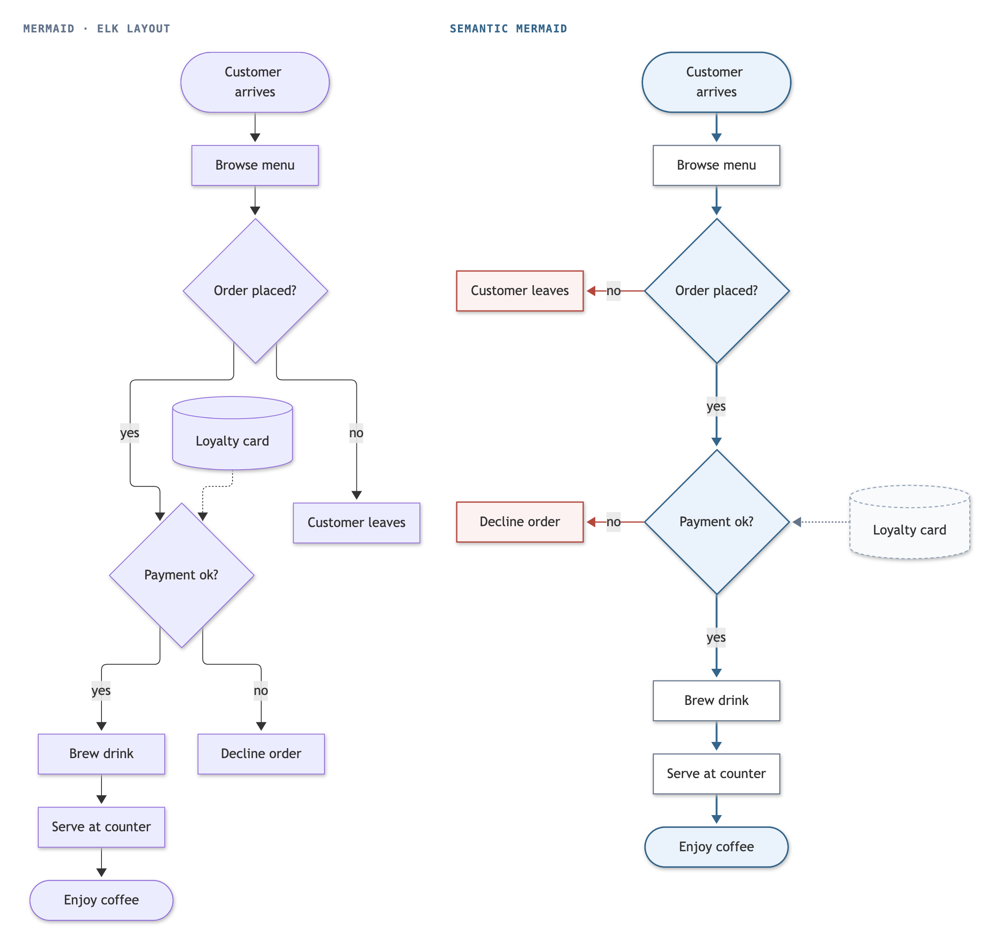

## [file-upload.mmd](file-upload.mmd): exit, retry and side box

An `@exit` for a file that fails the virus scan, an `@retry` that compresses an oversized file and checks its size again, and `@side Policy` for the upload policy.

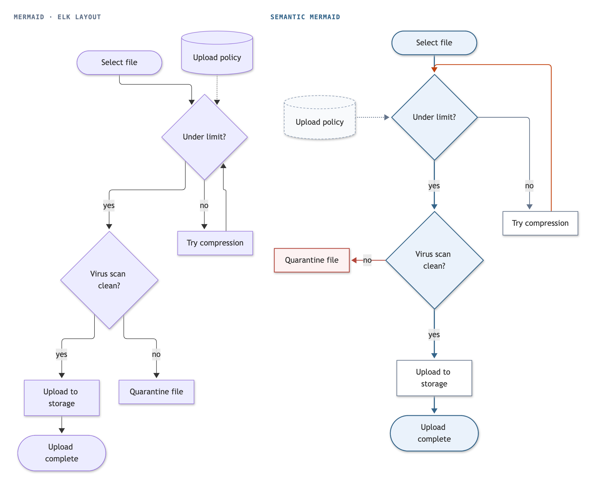

## [loan-application.mmd](loan-application.mmd): two declines and a counter-offer

Two `@exit` arrows for the two ways an application is declined, an `@retry` from a counter-offer back to the acceptance decision, and `@side Bureau` for the credit bureau.

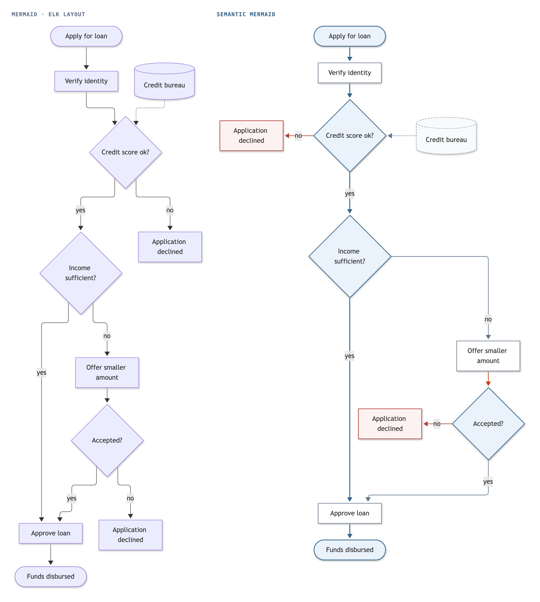

## [bug-triage.mmd](bug-triage.mmd): a retry and two side inputs

An `@retry` that asks for more information until the bug reproduces, and `@side Logs Runbook` for the error logs and the triage runbook.

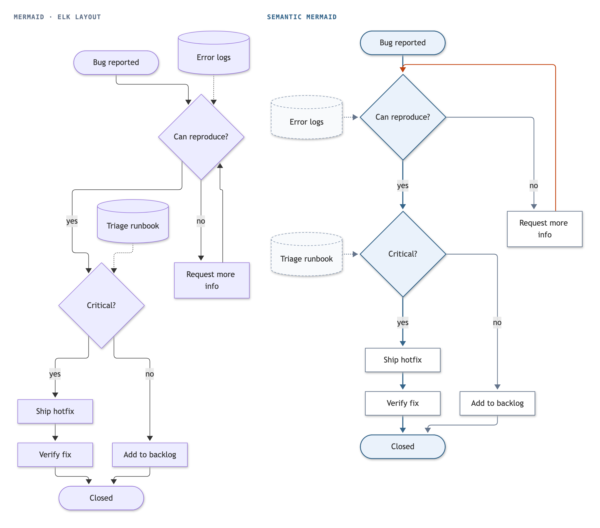

## [support-ticket.mmd](support-ticket.mmd): escalation as a retry

An `@retry` from escalation back into investigation, and `@side KB SLA` for the knowledge base and the SLA timer.

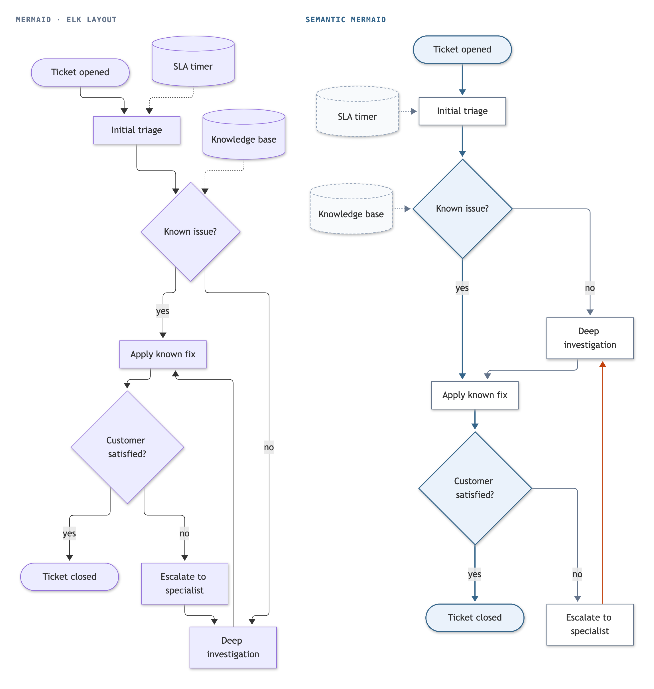

## [deployment-stages.mmd](deployment-stages.mmd): peers in order

`@peers` keeps five environments in their order. Left to right the row is longer than 8:1, so the engine draws it top-down.

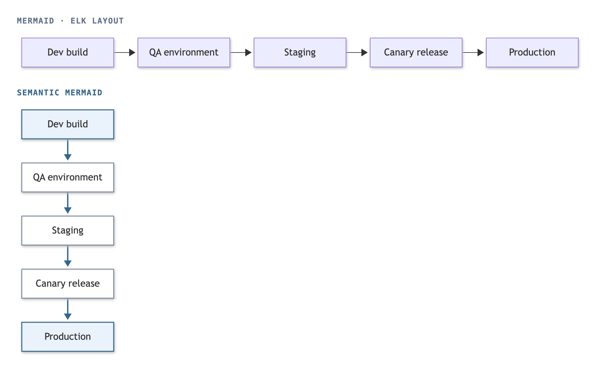

## [pipeline.mmd](pipeline.mmd): a side input

`@side dir`. The engine's own pipeline, drawn in the README's "How it works".

